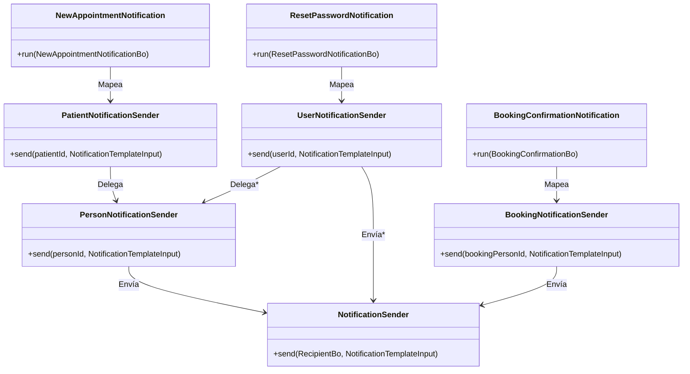
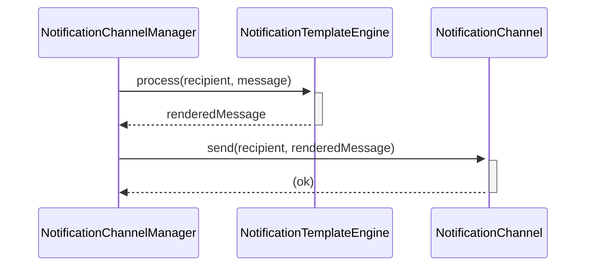
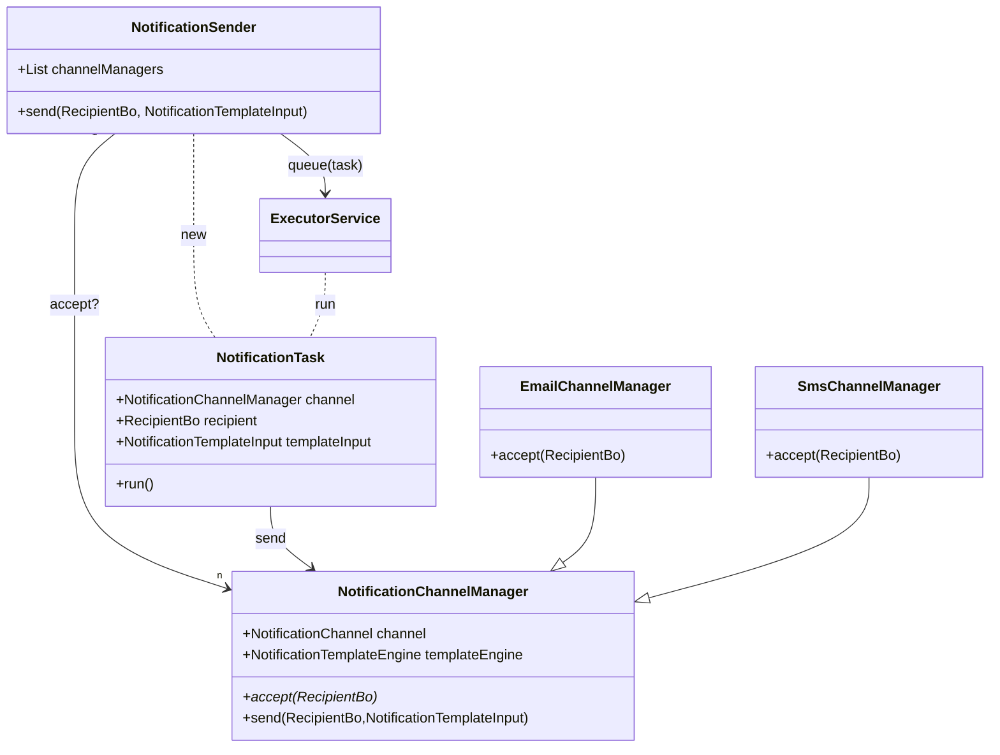
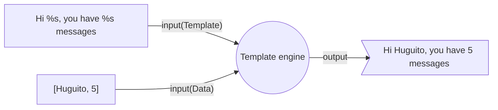

# Notifications

[[_TOC_]]

## Introducción

Las notificaciones de cara al usuario comunican información importante a las distintas personas que hacen uso de HSI.

Ejemplos de notificaciones son:

1. Confirmar al paciente del registro de un nuevo turno 
2. Confirmar al visitante el registro de una nueva reserva
3. Avisarle al paciente de una cancelación de turno
4. Avisarle al visitante de una cancelación de reserva
5. Enviar al usuario un link para reestablecer su clave
6. Avisarle al usuario de un nuevo login
7. Enviar al usuario un token de 2FA

Dado que se conoce que los canales de notificaciones pueden fallar, *se asume* que el equipo funcional tendrá en cuenta el escenario de reenvío cuando la notificación forme parte bloqueante de un flujo de uso.

## Construcción de la notificación

### Notification Ports

Los _casos de uso_ deben usar los _notification ports_ definidos para ofrecer las diferentes notificaciones disponibles. Para un ejemplo, ver [NewAppointmentNotification (1)](../hospital-api/src/main/java/net/pladema/medicalconsultation/appointment/application/port/NewAppointmentNotification.java).

Los _notification ports_ tienen la responsabilidad de obtener toda la información necesaria para enviar en el mensaje de la notificación. Si los parámetros que el _caso de uso_ le puede pasar no son suficientes, se pueden usar otros servicios. Por ejemplo, si en el mensaje tiene que figurar el nombre de la institución y el caso de uso solo tiene el identificador, entonces el _notification port_ buscará el nombre de la institución a partir del identificador.

Los _notification ports_ deberán elegir la implementación adecuada de [_Notification Template Input_](#notification-template-input) que indicará el identificador de la plantilla a usar y el DTO que estructura los argumentos que requiere esa plantilla.

 [//]: # (Notification Template Input era la primera vez que se nombraba, por eso se dejo el link en la misma palabra y no en un texto al final del párrafo.) 

Por ejemplo, el _notification port_ _NewAppointmentNotification_ crea un _NewAppointmentTemplateInput_ para enviarlo al [_Recipient Notification Sender_ de _Paciente_](#recipient-notification-senders).

 [//]: # (Acá tambien agruegue el link a Recipient Notification Sender. Más allá de que esté en la siguiente sección, a futuro puede cambiar, o a primera vista se puede no notar) 

### Recipient Notification Senders

Finalmente el _notification port_ podrá usar el _Recipient Notification Sender_ adecuado para su caso:

- `PersonNotificationSender` ([código](../hospital-api/src/main/java/net/pladema/person/infraestructure/output/notification/PersonNotificationSender.java))
  - se enviará la notificación al `personId` indicado.
- `PatientNotificationSender` ([código](../hospital-api/src/main/java/net/pladema/patient/infraestructure/output/notification/PatientNotificationSender.java))
  - se enviará la notificación al `patientId` indicado.
- `UserNotificationSender`
  - se enviará la notificación al `userId` indicado.
- `BookingPersonNotificationSender`(código)
  - se enviará la notificación al `bookingPersonId` indicado.
- `ProfessionalNotificationSender`
  - se enviará la notificación al `professionalId` indicado.

 [//]: # (Le quite los numeros a las calses y puse el código a parte para que sea más visual el resultado final, observandose de esta forma que lo unico que cambia es la entidad sobre la que opera cada Sender) 

Cada _RecipientNotificationSender_ tiene la responsabilidad de armar el [RecipientBo](../sgx-shared/src/main/java/ar/lamansys/sgx/shared/notifications/domain/RecipientBo.java) completando el _Nombre_ y _Apellido_ del receptor para poder ser usado en la plantilla para la generación del mensaje final. Además completará el _e-mail_, _número de teléfono_ o cualquier información de contacto soportado por el _Notification Sender_.

### Notification Building Diagram



## Envío de la notificación

### Notification Sender

El [NotificationSender](../sgx-shared/src/main/java/ar/lamansys/sgx/shared/notifications/application/NotificationSender.java) tiene la responsabilidad de buscar el primer _NotificationChannelManager_ de su lista que acepte el _Recipient_ para poder generar una [NotificationTask](../sgx-shared/src/main/java/ar/lamansys/sgx/shared/notifications/application/NotificationTask.java) (_implements Runnable_) que realizará el envío de manera asincrónica.

 [//]: # (Entiendo que NotificationChannelManager son los diferentes canales de comunicación, ya que veo EmailChannelManager) 

> Nota: se usa un `newCachedThreadPool`: Creates a thread pool that creates new threads as needed, but will reuse previously constructed threads when they are available.

Cuando llega el turno de ejecutar la _NotificationTask_ se termina llamando al `send` del _NotificationChannelManager_. 

### NotificationChannelManager

El [NotificationChannelManager](../sgx-shared/src/main/java/ar/lamansys/sgx/shared/notifications/application/NotificationChannelManager.java) además de tener la responsabilidad de indicar si acepta el mensaje analizando el _Recipient_, debe poder enviar el mensaje que obtenga de la renderización de la plantilla. Se usa un _Notification Template Engine_ para renderizar y un _Notification Channel_ para el envío.



La renderización de los mensajes se detalla [debajo](#renderizado-del-mensaje).

### Notification Channels

Una vez renderizado el mensaje para el canal, se envía por este utilizando los datos de contacto del _RecipientBo_, en el ejemplo del e-mail se llamaría a [EmailNotificationChannel](../sgx-shared/src/main/java/ar/lamansys/sgx/shared/emails/application/EmailNotificationChannel.java).

### Notification Sending Diagram



## Renderizado del mensaje

Para la construcción del mensaje a enviar se utilizan algún [Template Engine](https://en.wikipedia.org/wiki/Template_processor) adecuado para el canal.

> A template engine is software designed to combine _templates_ with a _data model_ to produce result documents.

### Template Engine Diagram


### Notification Template Input

La entrada de un _Template Engine_ se modela con una clase que extienda de [NotificationTemplateInput](../sgx-shared/src/main/java/ar/lamansys/sgx/shared/templating/NotificationTemplateInput.java) que tendrá la responsabilidad de combinar una plantilla con sus argumentos necesarios para que cada _NotificationTemplateEngine_ pueda renderizar esa plantilla.

Por ejemplo, en [NewAppointmentTemplateInput](../hospital-api/src/main/java/net/pladema/medicalconsultation/appointment/infraestructure/output/notification/NewAppointmentTemplateInput.java) se define el `templateId="new-appointment"` y sus argumentos de tipo [NewAppointmentNotificationArgs](../hospital-api/src/main/java/net/pladema/medicalconsultation/appointment/infraestructure/output/notification/NewAppointmentNotificationArgs.java).

### Notification Template Engines

Cada implementación de [NotificationTemplateEngine](../sgx-shared/src/main/java/ar/lamansys/sgx/shared/templating/impl/NotificationTemplateEngine.java) tiene la responsabilidad de generar un mensaje a partir de:
* `input` los datos de entrada contenidos en un _Notification Template Input_ 
* `recipient` los datos del _Recipient_
* Información provista por servicios globales, Feature Flags, propiedades, etc.

1. Template
   1. `input.templateId`: identificador de la plantilla
   2. `locale`: idioma del _Recipient_
2. Data
   1. `input.args`: DTO específico de la plantilla
   2. `recipient`: datos del destinatario, como su nombre de pila
   3. `env`: datos del ambiente, como su dominio público (`https://hsi...`).

#### HTML Template Engine

Sin dudas la implementación de _Notification Template Engine_ más importante es la que permite producir HTML renderizado en el back-end. Para esto Spring provee la **infraestructura** necesaria para utilizar diferentes _Template Engines_, como se explica en [Template Engines for Spring](https://www.baeldung.com/spring-template-engines). Se definió que este proyecto utilice Thymeleaf para producir el HTML de las notificaciones, ya que además es la herramienta utilizada también para la generación de PDFs (desde HTML).

Se puede entender que el uso de Thymeleaf permitirá invocar `String org.thymeleaf.ITemplateEngine.process(final String template, final IContext context)` donde `template` identifica la plantilla (_Template_) y `context` contiene los datos (_Data_) a utilizar. Particularmente se deberá instanciar la clase `SpringTemplateEngine` que implementa este método, para esto se ofrece la clase utilitaria [ar.lamansys.sgx.shared.templating.SpringTemplateUtils](../sgx-shared/src/main/java/ar/lamansys/sgx/shared/templating/SpringTemplateUtils.java) donde el método `createHtmlTemplateEngine(String templatePrefix, ...)` obliga definir el prefijo que permitirá obtener la plantilla a partir del `templateId`.

##### HTML Template Engine Testing

Se provee el [HTMLTemplateEngineTest](../sgx-shared/src/test/java/ar/lamansys/sgx/shared/templating/HTMLTemplateEngineTest.java) donde se pone a prueba el funcionamiento del _HTMLTemplateEngine_.

## Notification Template Testing

Para contar con una cobertura completa del funcionamiento de plantillas para las notificaciones se deberá validar el resultado de cada implementación de _NotificationTemplateInput_ para cada _NotificationChannelManager_.

| NotificationTemplateInput   | EmailChannelManager |
|-----------------------------|---------------------|
| `new-appointment`           | [NewAppointmentNotificationMessageTest](../hospital-api/src/test/java/net/pladema/medicalconsultation/appointment/infraestructure/output/notification/NewAppointmentNotificationMessageTest.java) |

Para poder implementar estos tests de manera más ágil se provee [TemplateTestingUtils.createExpectedResultAsserter](../sgx-shared/src/main/java/ar/lamansys/sgx/shared/templating/utils/testing/TemplateTestingUtils.java) que permitirá comparar el mensaje generado con un archivo guardado en `resources`.


Sería interesante contar con un test unitario por cada clase que extiende de _NotificationTemplateInput_ al menos para validar que el HTML generado sea el esperado. En este punto se podría comparar con un archivo HTML guardado entre los recursos de los tests, todo dentro del módulo correspondiente. 

```java
// back-end/hospital-api/src/main/java/[...]/NewAppointmentTemplateInput.java
class NewAppointmentNotificationMessageTest() {
    private BiConsumer<String, String> mailBodyResultAsserter;
    // ...
    @BeforeEach
    void setUp() {
        // ...
        this.mailBodyResultAsserter = createExpectedResultAsserter(
                "mail-body",                            // channel
                NewAppointmentTemplateInput.TEMPLATE_ID // template
        );
    }
    @Test
    void minimalRequiredData() {
        var mail = this.renderMessage();
        // Will compare mail body with resources/templates/notifications/{channel}/{template}-{scenario}.html placed in same module.
        // In this example, module = hospital-api, so file will be found at hospital-api/src/test/resources/templates/notifications/mail-body/new-appointment-requiredArgs.html
        mailBodyResultAsserter.accept(
                "requiredArgs",    // scenario 
                mail.body       // result
        );
    }
}
```

Además se puede visualizar en un navegador el archivo guardado realizando los siguientes pasos:

```shell
npx http-server -p 5001 back-end
```

Luego se puede abrir en un navegador la URL: http://127.0.0.1:5001/hospital-api/src/test/resources/templates/notifications/mail-body/new-appointment-requiredArgs.html

## Exception Handling

El análisis de los posibles problemas y cómo deberían manejarse se puede realizar por responsabilidad:

1. Notification Ports: puede haber un problema al recolectar los argumentos de la plantilla. Se debería manejar de acuerdo al lo que disponga el caso de uso.
2. Recipient Notification Senders: aunque sería raro, puede no existir el receptor, en cuyo caso tiene sentido descartar la notificación.
3. Notification Sender: es tan normal la ocurrencia de errores en esta etapa como insalvables por lo que simplemente se deberá registrar el error en el log.
    1. Notification Template Engines: el uso de DTOs para estructurar los argumentos mitigaría la posibilidad de errores en esta etapa.
    2. Notification Channels: podrían aparecer errores de conexión o de aplicación en este punto.