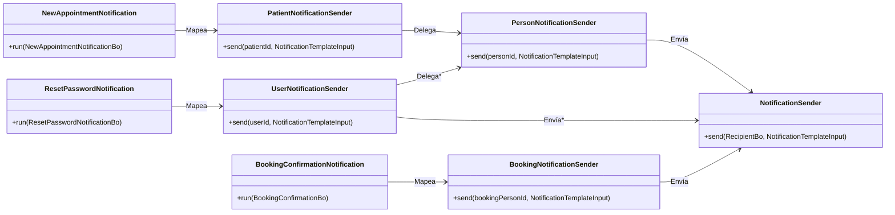

# Notifications

[[_TOC_]]

## Introducción

Las notificaciones de cara al usuario comunican información importante a las distintas personas que hacen uso de HSI.

Ejemplos de notificaciones son:

1. Confirmar al paciente del registro de un nuevo turno 
2. Confirmar al visitante el registro de una nueva reserva
3. Avisarle al paciente de una cancelación de turno
4. Avisarle al visitante de una cancelación de reserva
5. Enviar al usuario un link para reestablecer su clave
6. Avisarle al usuario de un nuevo login
7. Enviar al usuario un token de 2FA

Dado que se conoce que los canales de notificaciones pueden fallar, *se asume* que el equipo funcional tendrá en cuenta el escenario de reenvío cuando la notificación forme parte bloqueante de un flujo de uso.

## Construcción de la notificación

### Notification Ports

Los _casos de uso_ deben usar los _notification ports_ definidos para ofrecer las diferentes notificaciones disponibles. Para un ejemplo, ver [NewAppointmentNotification (1)](../hospital-api/src/main/java/net/pladema/medicalconsultation/appointment/application/port/NewAppointmentNotification.java).

Los _notification ports_ tienen la responsabilidad de obtener toda la información necesaria que se va a necesitar enviar en el mensaje de la notificación. Si los parámetros que el _caso de uso_ le puede pasar no son suficientes, se pueden usar otros servicios. Por ejemplo, si en el mensaje tiene que figurar el nombre de la institución y el caso de uso solo tiene el identificador, entonces el _notification port_ buscará el nombre de la institución a partir del identificador.

Los _notification ports_ deberán elegir la implementación adecuada de _Notification Template Input_ que indicará el identificador de la plantilla a usar y el DTO que estructura los argumentos que requiere esa plantilla. Mas adelante se profundiza en [Notification Templates](#notification-template-input).

### Recipient Notification Senders

Finalmente el _notification port_ podrá usar el _RecipientNotificationSender_ adecuado para su caso:

1. [PersonNotificationSender](../hospital-api/src/main/java/net/pladema/person/infraestructure/output/notification/PersonNotificationSender.java): se enviará la notificación al `personId` indicado.
2. [PatientNotificationSender](../hospital-api/src/main/java/net/pladema/patient/infraestructure/output/notification/PatientNotificationSender.java): se enviará la notificación al `patientId` indicado.
3. UserNotificationSender: se enviará la notificación al `userId` indicado.
4. BookingPersonNotificationSender: se enviará la notificación al `bookingPersonId` indicado.
5. ProfessionalNotificationSender: se enviará la notificación al `professionalId` indicado.

Cada _RecipientNotificationSender_ tiene la responsabilidad de armar el [RecipientBo](../sgx-shared/src/main/java/ar/lamansys/sgx/shared/notifications/domain/RecipientBo.java) completando el _Nombre_ y _Apellido_ del receptor para poder ser usado en la plantilla para la generación del mensaje final. Además completará el _e-mail_, _número de teléfono_ o cualquier información de contacto soportado por el _Notification Sender_.

### Notification Building Diagram



## Notification Sender

El [NotificationSender](../sgx-shared/src/main/java/ar/lamansys/sgx/shared/notifications/application/NotificationSender.java) tiene la responsabilidad de buscar el primer _NotificationChannelManager_ de su lista que acepte el _Recipient_ para poder generar una [NotificationTask](../sgx-shared/src/main/java/ar/lamansys/sgx/shared/notifications/application/NotificationTask.java)

> Nota: se usa un `newCachedThreadPool`: Creates a thread pool that creates new threads as needed, but will reuse previously constructed threads when they are available.

Cuando llega el turno de ejecutar la _NotificationTask_ se termina llamando al `send` del _NotificationChannelManager_. 

### NotificationChannelManager

El [NotificationChannelManager](../sgx-shared/src/main/java/ar/lamansys/sgx/shared/notifications/application/NotificationChannelManager.java) además de tener la responsabilidad de indicar si acepta el mensaje analizando el _Recipient_, debe poder enviar el mensaje que obtenga de la renderización de la plantilla. Se usa un _Notification Template Engine_ para renderizar y un _Notification Channel_ para el envío. 

### Notification Template Engines

Para el renderizado de los mensajes de cada canal se utiliza alguna implementación del [NotificationTemplateEngine](../sgx-shared/src/main/java/ar/lamansys/sgx/shared/templating/impl/NotificationTemplateEngine.java) que tiene la responsabilidad de generar el mensaje de acuerdo al canal  a partir del _Notification Template Input_, el idioma del usuario y los datos del _Recipient_ como su _Nombre_ de pila.

Tomando de ejemplo el e-mail, dado que el mensaje está formado por un _Asunto_ y un _Cuerpo_ en [MailTemplateEngine](../sgx-shared/src/main/java/ar/lamansys/sgx/shared/templating/MailTemplateEngine.java) se utiliza un [TextTemplateEngine](../sgx-shared/src/main/java/ar/lamansys/sgx/shared/templating/TextTemplateEngine.java) para generar el _Asunto_ y un [HTMLTemplateEngine](../sgx-shared/src/main/java/ar/lamansys/sgx/shared/templating/HTMLTemplateEngine.java) para generar el _Cuerpo_.

### Notification Channels

Una vez renderizado el mensaje para el canal, se envía por este utilizando los datos de contacto del _RecipientBo_, en el ejemplo del e-mail se llama a [EmailNotificationChannel](../sgx-shared/src/main/java/ar/lamansys/sgx/shared/emails/application/EmailNotificationChannel.java).

## Full Diagram


## Exception Handling

El análisis de los posibles problemas y cómo deberían manejarse se puede realizar por responsabilidad:

1. Notification Ports: puede haber un problema al recolectar los argumentos de la plantilla. Se debería manejar de acuerdo al lo que disponga el caso de uso.
2. Recipient Notification Senders: aunque sería raro, puede no existir el receptor, en cuyo caso tiene sentido descartar la notificación.
3. Notification Sender: es tan normal la ocurrencia de errores en esta etapa como insalvables por lo que simplemente se deberá registrar el error en el log.
   1. Notification Template Engines: el uso de DTOs para estructurar los argumentos mitigaría la posibilidad de errores en esta etapa. 
   2. Notification Channels: podrían aparecer errores de conexión o de aplicación en este punto.

## Notification Template Input

Cada clase que extiende de [NotificationTemplateInput](../sgx-shared/src/main/java/ar/lamansys/sgx/shared/templating/NotificationTemplateInput.java) tiene la responsabilidad de modelar una plantilla con su DTO de argumentos necesarios para que cada _NotificationTemplateEngine_ pueda renderizar la plantilla.

Por ejemplo, en [NewAppointmentTemplateInput](../hospital-api/src/main/java/net/pladema/medicalconsultation/appointment/infraestructure/output/notification/NewAppointmentTemplateInput.java) se define el `templateId` que luego en el caso del [MailTemplateEngine](../sgx-shared/src/main/java/ar/lamansys/sgx/shared/templating/MailTemplateEngine.java) resolverá usar la plantilla para HTML ubicada en `classpath:/templates/mails/new-appointment.html`. Las plantillas HTML se implementan con `SpringTemplateEngine` y [thymeleaf](https://www.thymeleaf.org/).

Al buscar las plantillas en el `classpath` se permite que cada módulo tenga sus plantillas siempre que respete la ubicación, de esta manera:

1. NewAppointmentTemplateInput.java y "new-appointment.html" en "hospital-api"
2. [ConfirmarReservaTemplateInput.java](../booking/src/main/java/ar/lamansys/online/infraestructure/notification/message/ConfirmarReservaTemplateInput.java) y "email-confirmar-reserva.html" en "booking"

Además el módulo "app" puede ofrecer fragmentos como `header` y `footer` para uso en común por las plantillas. 

> Thymeleaf Fragments to reuse some common parts of a site

Por último vale la pena remarcar que _MailTemplateEngine_ permite configurar la ubicación de las plantillas, por lo que un dominio podría pisar el 100% de las plantillas y sus fragmentos usados por el sistema.

## Notification Template Testing

Sería interesante contar con un test unitario por cada clase que extiende de _NotificationTemplateInput_ al menos para validar que el HTML generado sea el esperado. En este punto se podría comparar con un archivo HTML guardado entre los recursos de los tests, todo dentro del módulo correspondiente. 

```java
class NewConfirmationTemplateInputTest() {
    @Test
    void minimalRequiredData() {
        var recipient = minimalRequiredDataRecipient();
        var dto = new NewConfirmationTemplateInput(minimalRequiredDataDto());
        var htmlContent = templateEngine.process(recipient, dto);
        assertEquals(htmlContent, loadFileContent(NewConfirmationTemplateInput.templateId ,"minimalRequiredData.html"));
    }
}
```

Además esto permitiría observar visualmente el archivo HTML guardado para confirmar que se ve correctamente, usando:

```shell
npx http-server -p 5001 hospital-api/src/test/resources/render/mails/new-appointment
```

Lo que permitiría ver el mail renderizado en `http://localhost:5001/minimalRequiredData.html`.

Otra opción sería generar una imagen con el renderizado y comparar visualmente, o mas sencillo usar MD5.
