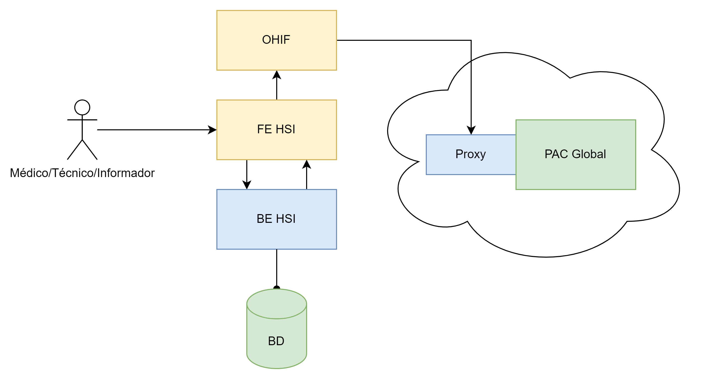
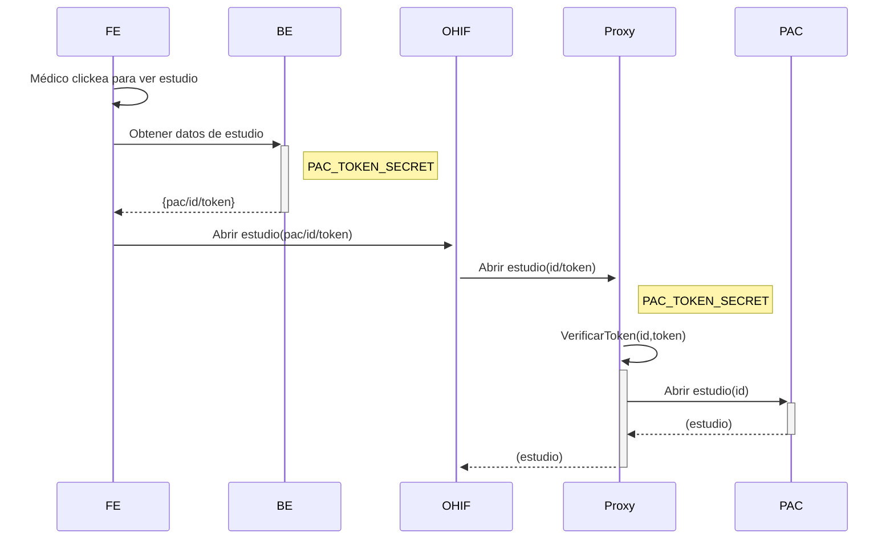

# README imagenetwork en construcción

## Componentes participantes en el flujo que corresponde a obtener un estudio médico de un paciente

## Diagrama de secuencia del manejo de autenticación del backend de HSI y el proxy del PAC global

## Comentarios adicionales

PATHS HABILITADOS. Solamente se permite consultar los paths:

`/dicom-web/studies`
`/wado`

Se bloquearon todos los demás *paths* porque no son necesarios y algunos no deben exponerse a la red.