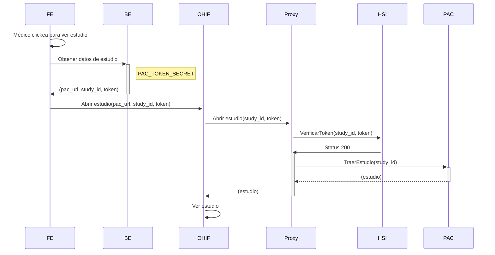

## Image Network
Las razones principales para instanciar un proxy inverso en cada servidor PAC que almacene información de los estudios médicos de cada paciente, es para ofrecer seguridad y control de flujo de la información entre el cliente (en este caso HSI) y el servidor PAC.

En el paquete denominado ```ar.lamansys.pac``` se encuentra toda la configuración de filtros de autorización que realiza el servidor proxy.

## Breve descripción
El componente soporta estas formas de autenticación para que los usuarios accedan a los recursos.
- A través del uso de tokens JWT, las cuales se pueden hacer de alguna de las siguientes formas:
  - Donde este proxy es quien genera y verifica los tokens. Se necesita configurar las properties opcionales:
    - ```app.imagenetwork.token.secret```
    - ```app.imagenetwork.token.expiration```
  - Donde este proxy delega la responsabilidad de autenticar y generar permisos a una instancia de HSI.
- A través del uso de tokens UUID
  - Donde el proxy delega la responsabilidad de autenticar y generar permisos a una instancia de HSI.

## Componentes participantes en el flujo que corresponde a obtener un estudio médico de un paciente


## Diagrama de secuencia del manejo de autenticación del backend de HSI y el proxy del PAC global


## Instrucciones


### Propiedades definidas específicas de seguridad

| Propiedad                          | Variable de ambiente    | Valor por defecto                                                                                                                                                    | Necesidad       | Descripcion                                                                                                                                   | Desde |
|------------------------------------|-------------------------|----------------------------------------------------------------------------------------------------------------------------------------------------------------------|-----------------|-----------------------------------------------------------------------------------------------------------------------------------------------|-------|
| app.proxy.pac.username             | APP_PROXY_PAC_USERNAME  | admin                                                                                                                                                                | **Obligatorio** | Usuario administrador para acceder al servidor PAC de imágenes médicas, a través del uso de Basic Auth en HTTP.                               | 0.0.1 |
| app.proxy.pac.password             | APP_PROXY_PAC_PASSWORD  | admin                                                                                                                                                                | **Obligatorio** | Contraseña de administrador para acceder al servidor PAC (Basic Auth).                                                                        | 0.0.1 |
| app.imagenetwork.can-verify-token  | PROXY_CAN_VERIFY_TOKEN  | false                                                                                                                                                                | **Obligatorio** | Flag que indica si el reverse-proxy puede validar tokens JWT (siempre que se use el mismo secreto que HSI).                                   | 0.0.1 |
 | app.imagenetwork.token.secret      | TOKEN_SECRET            | ultra_secret_token                                                                                                                                                   | Opcional        | Secreto, para que en caso de que el proxy del PAC se le permita descifrar tokens JWT, lo pueda hacer.                                         | 0.0.1 |
| app.imagenetwork.token.expiration  | TOKEN_EXPIRATION        | 30m                                                                                                                                                                  | Opcional        | Validez del token una vez generado por el proxy, en caso de que se permita hacerlo.                                                           | 0.0.1 |
| app.imagenetwork.allowed.endpoints | PROXY_ALLOWED_ENDPOINTS | /wado/**,/dicom-web/studies/**,/dicom-web/series/**,/dicom-web/instances/**,/dicom-web/modalities/**,/dicom-web/queries/**,/dicom-web/patients/**,/dicom-web/jobs/** | Opcional        | Conjunto de "paths" habilitados para ser consultados, todo aquel que no se encuentre aquí definido, será rechazado.                           | 0.0.1 |
| app.hsi.url                        | APP_HSI_URL             | http://localhost:8080                                                                                                                                                | **Obligatorio** | Dirección URL donde se encuentra hosteado HSI, para poder comunicarse con él para delegar la autorización de tokens recibidos.                | 0.0.1 |
| app.hsi.api-key.header             | -                       | api-key                                                                                                                                                              | Único           | Header HTTP correspondiente para soporte del método api-key para comunicar el proxy con HSI (debe ser el mismo definido para HSI).            | 0.0.1 |
| app.hsi.api-key.value              | APIKEY                  | -                                                                                                                                                                    | **Obligatorio** | Valor conocido solamente entre HSI y el proxy, utilizado para que cuando el proxy se comunique con HSI, utilice este método de autenticación. | 0.0.1 |

