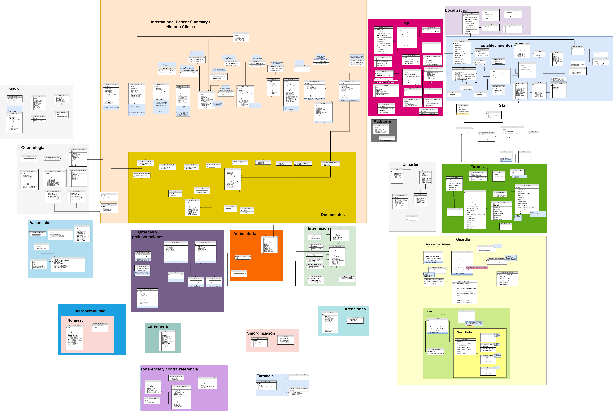

# Diagrama de entidad-relación

En la imagen se puede ver el diagrama actualizado. El mismo esta dividido en secciones para que sea más sencillo su entendimiento.

Las secciones definidas son:

- SNVS — *Sistema Nacional de Vigilancia de la Salud* —
- Historia clínica
	- Documentos
- MPI — *identificación unívoca de pacientes* —
- Localización
- Establecimientos
- Staff
- Auditoría
- Odontología
- Usuarios
- Turnos — *incluye gestión de agendas* —
- Vacunación
- Órdenes y prescripciones
- Ambulatoria
- Internación
- Guardia
	- Triages
		- Triage pediátrico
- Interoperabilidad
- Enfermería
- Sincronización
- Atenciones
- Referencia y contrarreferencia