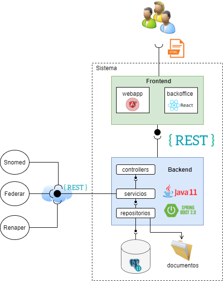

# Arquitectura del sistema

El proyecto de hospitales se centro en realizar un sistema web que permite a los usuarios poder llevar a cabo las distintas tareas diarias que se presentan en su trabajo. A partir de las distintas reuniones que se tuvieron con el cliente se llego a establecer la siguiente arquitectura.

Como se puede apreciar en la imagen, el sistema tiene dos grandes componentes que lo conforman. La parte de frontend y la de backend.

## Frontend

Este componente esta dividido en dos aplicaciones: webapp y backoffice. Cada una de ellas estan enfocadas en distintas funcionalidades del sistema.

### Webapp

Esta implementada usando [Angular 12](https://angular.io/) y sus componentes gráficos usan [Angular Material] (https://material.angular.io/).

Este componente gestiona toda la funcionalidad más compleja del sistema (por ejemplo: internaciones, consultas ambulatorias, turnos, busqueda de paciente, historia electronica). Tiene comunicación con el servidor de Snomed para la búsqueda de los terminos clinicos utilizados en la aplicación y con la API de backend.

### Backoffice

Aplicación desarralada en [React](https://es.reactjs.org/) utilizando el framework [React-admin] (https://marmelab.com/react-admin/). 

En este caso el componente busca simplicidad y rapidez para el desarrollo de funcionalidades básicas como: creación de usuarios, instituciones, profesionales, etc. 

El mismo mantiene, al igual que el componente de webapp, comunicación con la API de backend. 

## Backend

Esta implementado con [Java 11](https://www.java.com/es/download/) y usando el framework de [Spring Boot 2.6](https://spring.io/projects/spring-boot). 

Este componente tiene la responsabilidad de proveer la API REST necesaria para cada uno de los componentes de frontend. Sigue una arquitectura en capas:

1. Controllers: se encuentran definidos los endpoints de la aplicación, se realiza la validaciones de los request y control de permisos.
2. Services: almacena la lógica del negocio.
3. Repositorios: se centra en comunicarse con la base de datos para la lectura y escritura de información. A su vez tiene la lógica para almacenar datos en disco.

## Base de datos

La base de datos elegída es [PostgreSQL 11](https://www.postgresql.org/about/news/1894/). Es una base datos relacional open source.

## Servicios externos

El sistema manteniene comunicación con dos servicios externos para obtener distintos tipos de información.

### Snowstorm

Servicio que provee la terminología médica estándar (SNOMED) utilizada por la aplicación.

### Renaper

Servicio que permite buscar la información personal de cada paciente del sistema.

### Federar

Servicio que permite registrar pacientes en el bus de interoperabilidad.
