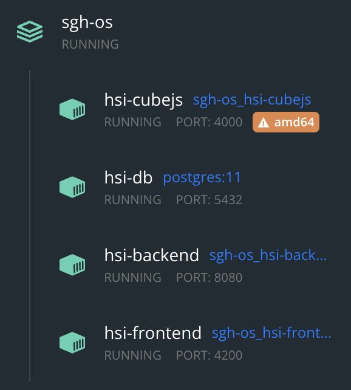

# HSI | Historia de Salud Integrada

Este documento detalla las cuestiones relacionadas con la gestión del ambiente de desarrollo local al desarrollador.

## Ambiente

Estos pasos indican cómo buildear localmente y levantar todos los módulos del sistema.

Los comandos se deben ejecutar en la carpeta raíz del proyecto.

### Build

Se deben buildear los siguientes módulos:

1. Backend:
    > `docker run -itv "$PWD":/usr/src/app -w /usr/src/app maven:3-openjdk-11 ./back-end/build.sh`
2. Frontend:
    > `docker run -itv "$PWD":/usr/src/app -w /usr/src/app node:16 ./front-end/build.sh`

Por último se puede iniciar todo ejecutando:

> `docker-compose up --build -d`

> El flag `--build` es para asegurarse que se buildee la imagen para evitar que se utilice una versión anterior.
> El flag `-d` es para levantar los contenedores en background.

Se aconseja instalar la extensión [Docker for Visual Studio Code](https://marketplace.visualstudio.com/items?itemName=ms-azuretools.vscode-docker) que entre otras cosas permite ver el log del backend fácilmente dentro de VSC.

### Desarrollo de frontend

Se puede detener el contenedor del frontend para usar el [servidor de desarrollo](../front-end/apps#development-server).

### Desarrollo de backend

Alternativamente se puede modificar la variable `API_IP_PORT` en `environment` de `hsi-frontend` para que el contenedor del frontend apunte al servidor de desarrollo del backend en el 8080 del [host](https://dev.to/natterstefan/docker-tip-how-to-get-host-s-ip-address-inside-a-docker-container-5anh):

> `API_IP_PORT: host.docker.internal:8080 // Windows 🪟 & MacOS 🍎`
> `API_IP_PORT: 172.17.0.1:8080 // Linux 🐧`

Se deberá volver a componer:

> `docker-compose up --build -d`

Finalmente se debe detener el contenedor del backend para usar el [servidor de desarrollo](../back-end#desde-un-ide-de-preferencia).