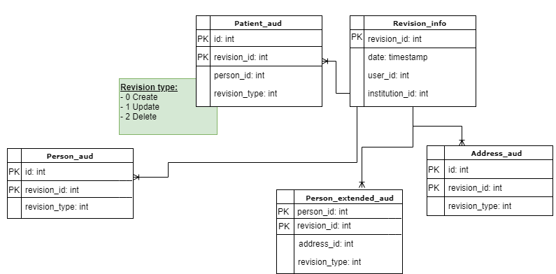
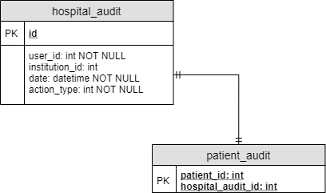

Auditoría de pacientes  
------------------------

### Requerimiento

Es necesario incorporar auditoría al momento de admitir un nuevo paciente en el MPI, cuando se editan sus datos y también cuando se logra federar correctamente desde el cron. Esta nueva funcionalidad está únicamente orientada a satisfacer la necesidad de realizar un correcto seguimiento de las implementaciones del HSI en los dominios y a permitir, en un futuro, realizar diferentes reportes. [[Link](https://taiga.lamansys.com/project/mrisso-hce/us/4683?milestone=316) asociado a la historia de usuario]

#### Parámetros a tener en cuenta

* Se debe considerar no perder la auditoría de ningún evento sobre el paciente.
* Si surge un error al procesar la auditoría, el caso de uso a la que esté relacionada, no debe concretar su flujo ideal.
* Se debe persistir la siguiente información asociada a los eventos de alta o edición sobre pacientes:   
 
  - Identificador de la auditoría.  
  - Identificador de la institución. 
  - Identificador del usuario que lleva a cabo la acción. En caso de que no haya usuario involucrado, definir como diferenciarlo del resto.   
  - Fecha y hora.  
  - Tipo de acción \[alta/edición\]

### Solución de diseño  

A la hora de buscar una implementación que cumpla con los requisitos necesarios para llevar a cabo la auditoría se estudiaron diferentes alternativas. Un punto verdaderamente importante a tener en cuenta fue que la información de los pacientes actualmente se encuentra distribuida en diferentes tablas dentro de la base de datos: **patient**, **person**, **person\_extended**, **address**.  

#### Hibernate Envers

En resumidas palabras Envers es un módulo de Hibernate que se encarga de crear las tablas de auditoría histórica necesarias y almacenar los cambios realizados en las entidades auditadas, provee respaldo para seleccionar que campos requieren auditoría en una determinada entidad y basta con extender de la interfaz RevisionRepository para habilitar el acceso a las operaciones de recuperación de información.

**DERE de auditoría de pacientes implicando Envers**

Se decidió descartar la idea de incluir la auditoría acudiendo a Envers dado que al estar los datos de los pacientes distribuidos en varias tablas no solo era necesario crear una tabla por cada entidad involucrada sino que también requería esfuerzo extra al recopilar los datos que se necesitan exponer sobre los eventos de auditoría en pacientes.

#### Logback

Logback es un framework de logueo cuyo propósito es dejar constancia de una determinada transacción en tiempo de ejecución. Se encarga de delegar la tarea de escribir los eventos de registros a los componentes llamados Appenders que son los principales responsables de enviar mensajes de registro a diferentes destinos como por ejemplo a un archivo (FileAppender, RollingFileAppender), a un servidor remoto donde almacenar registros (SocketAppender), a una dirección de correo electrónico (SMTPAppender), e incluso en una base de datos (JDBCAppender). Debido a que Logback requiere que se lleve a cabo creación de tres tablas **logging\_event**, **logging\_event\_property** y **logging\_event\_exception** con datos que para este caso no eran relevantes y que además escapaban de nuestro requerimiento principal, se decidió dejar de lado la opción de incorporar la auditoría mediante loggers.

#### Diseño final

Dado a la complejidad de las alternativas mencionadas anteriormente finalmente se decidió incorporar la auditoría creando dos nuevas tablas; _**hospital\_audit**_, en la cual se van a persistir los datos generales de la auditoría (identificador de usuario, fecha, tipo de acción, identificador de auditoría e identificador de institución), y _**patient\_audit**_ en donde se persistirá el identificador del paciente y el identificador de hospital\_audit correspondiente al evento. Se poblarán ambas tablas ante los eventos de edición, ya sea mediante la webapp o mediante el cron federador, como así también al dar de alta un paciente. En caso de que no se pueda concretar la auditoría por algún motivo en especial, el flujo ideal de alta o edición de paciente se verá afectado y no se podrá concluir con el mismo. Este modelo, además, provee soporte para utilizar la tabla hospital\_audit en caso de requerir incorporar auditoría en otras entidades siempre y cuando convenga utilizar dicho enfoque a la hora de auditar información.

### Issues

Se descarta por el momento llevar a cabo un análisis relacionado al mantenimiento de los datos persistidos en las nuevas tablas de auditoria de pacientes.