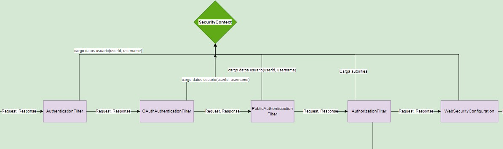

Implementación de flujo de autenticación con OAuth2 en HSI
------------------------

### Requerimiento
Para incorporar la autenticación mediante un servidor de OAuth2 se requieren hacer cambios tanto a nivel de Front End para obtener el acceso a la aplicación sin necesidad de ingresar las credenciales del usuario en HSI, cono a nivel de Back End para validar el acceso otorgado.

#### Parámetros a tener en cuenta

* La autenticación no debe interferir con los otros tipos de autenticación ya existentes en HSI (mediante token JWT generado por nuestro sistema, mediante API key).

### Solución de diseño  

La solución a grandes rasgos se basa en la obtención de un *Access token* otorgado por el servidor de OAuth y validarlo al momento de brindar los recursos en el Back End. Para acceder a estos recursos, el Front End debe guardar el *Access token* y enviarlo en cada solicitud al Back End. Un ejemplo de los pasos resumidos para acceder a la WebApp son los que siguen:

1.	El usuario accede a la WebApp. Solicita ingresar a la aplicación.
2.	La WebApp lo redirige al servidor de OAuth.
3.	El usuario ingresa sus credenciales en el servidor de OAuth.
4.	Tras el ingreso correcto de credendiales, el servidor de OAuth lo redirige a la WebApp, otorgándole un *Access token*.
5.	La WebApp envía ese *Access token* en cada solicitud hacia el Back End.
6.	El Back End autentica al usuario validando el *Access token* contra el servidor de OAuth.

#### Implementación en Front End - WebApp

Debido a que se busca una implementación agnóstica a la tecnología usada en el servidor de OAuth, se usa la biblioteca **angular-oauth2-oidc**, la cual facilita la comunicación con cualquier servidor que implemente OAuth2 junto con el protocolo OpenID Connect.

OAuth2 tiene varias alternativas en cuanto a flujos de autorización, las cuales pueden ser más o menos aptas para el escenario propuesto. Se tuvo en cuenta la información en [este artículo](https://auth0.com/docs/authorization/flows/which-oauth-2-0-flow-should-i-use) para decidir qué flujo es el más adecuado. Sobre los principales flujos se determinó que:

* Authorization Code Flow: no es adecuado para nuestro escenario ya que requiere el envío de un client secret, y debido a que la WebApp corre en el navegador, este podría ser potencialmente revelado.
* Implicit Flow: si bien es más apropiado para aplicaciones Web en comparación al Authorization Code Flow, es un flujo deprecado debido a que hay otros más seguros.
* Authorization Code Flow with Proof Key for Code Exchange (PKCE): es una evolución de Implicit Flow, que agrega pasos extra para mejorar la seguridad. Se pueden encontrar más detalles sobre este flujo en [este link](https://auth0.com/docs/authorization/flows/authorization-code-flow-with-proof-key-for-code-exchange-pkce).

La configuración de la biblioteca permite configurar este flujo. Los parámetros como la URL del servidor de OAuth y el nombre del cliente son obtenidos a través del endpoint público /oauth/config en el Back End. 

#### Implementación en Front End - Backoffice

Se decide quitar la página de login en el backoffice, de manera que el login se haga desde la WebApp y desde allí se acceda al backoffice si es que el usuario tiene los permisos necesarios.

#### Implementación en Back End

Si bien existen bibliotecas de Spring para OAuth (o Keycloak), se decide comunicar el Back End directamente con la REST API.

Para autenticar, se agrega un nuevo filtro de autenticación en la cadena de HttpSecurity que ejecuta Spring. Este filtro se encarga de cargar los datos del usuario comunicándose con el servidor de OAuth, y se ubica junto a los ya existentes de autenticación (AuthenticationFilter y PublicApiAuthenticationFilter) y antes del de autorización (AuthorizationFilter). El orden es importante, ya que debe cargar los datos básicos del usuario antes de cargar sus roles.

A nivel interno del filtro, si los datos del usuario no están ya cargados (lo que significaría que se autenticó por otro método), intentará obtener el Access token del header Authorization de la solicitud HTTP, e intentará validar el mismo contra el servidor de OAuth. Para realizar esta validación, se usa la REST API del servidor, específicamente el endpoint userinfo provisto en OpenID Connect, que además de validar el token, devuelve información útil sobre el usuario, como su username. 

Una vez obtenidos correctamente los datos del usuario, se carga el contexto de autenticación según su username. Cuando se ejecute posteriormente el filtro de autorización, se cargarán los roles del usuario cargado en el contexto. 

En [este diagrama](https://app.diagrams.net/#G1MBGuycUFb_0cm_LxyXIu7bov2uYV_Nxo) se esquematiza y explica detalladamente cómo queda en principio la cadena de filtros a ejecutar.

#### Configuración de servidor de OAuth2 

Es necesario configurar el servidor de OAuth para que funcione en la solución propuesta. Parrticularmente, en Keycloak se debe crear un realm para manejar un conjunto de usuarios. Dentro de las configuraciones del realm creado, hay que crear un **cliente público**, cuyo protocolo sea openid-connect. Esto es para que no requiera un client secret para acceder a él, y para que se esté provisto de las características de autenticación de OpenID Connect.

Además, se tienen que habilitar las opciones **Standard Flow Enabled** y **Direct Access Grants Enabled** para que se pueda ejecutar correctamente el flujo Authorization Code Flow with PKCE.

#### Propiedades de web service de OAuth

Se definen propiedades de configuración para el servicio de OAuth, las cuales son cargadas al momento de iniciar el Back End y el Front End obtiene algunas de ellas a través de un endpoint.

| Nombre | Descripción |
| ------ | ------ |
| ws.oauth.enabled  | Flag que indica si el servicio de OAuth está o no activo en nuestro sistema |
| ws.oauth.url.base  | URL base del servidor de OAuth |
| ws.oauth.realm  | Nombre del realm en el servidor de OAuth en el cual van a estar los usuarios del sistema |
| ws.oauth.url.issuer | URL base del issuer con el que va a estar comunicándose el FE para obtener los *Access tokens* |
| ws.oauth.client-id | ID del cliente público en el realm |
