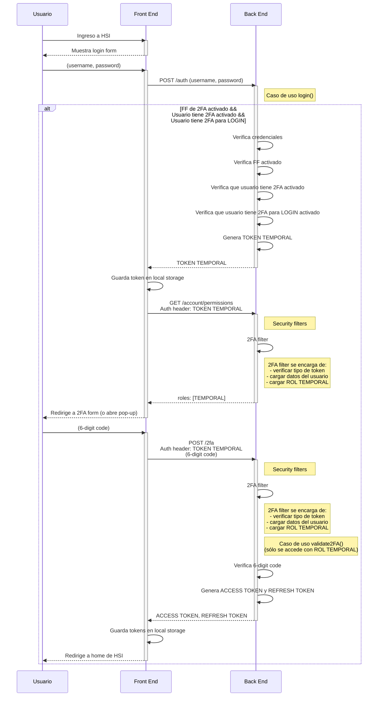
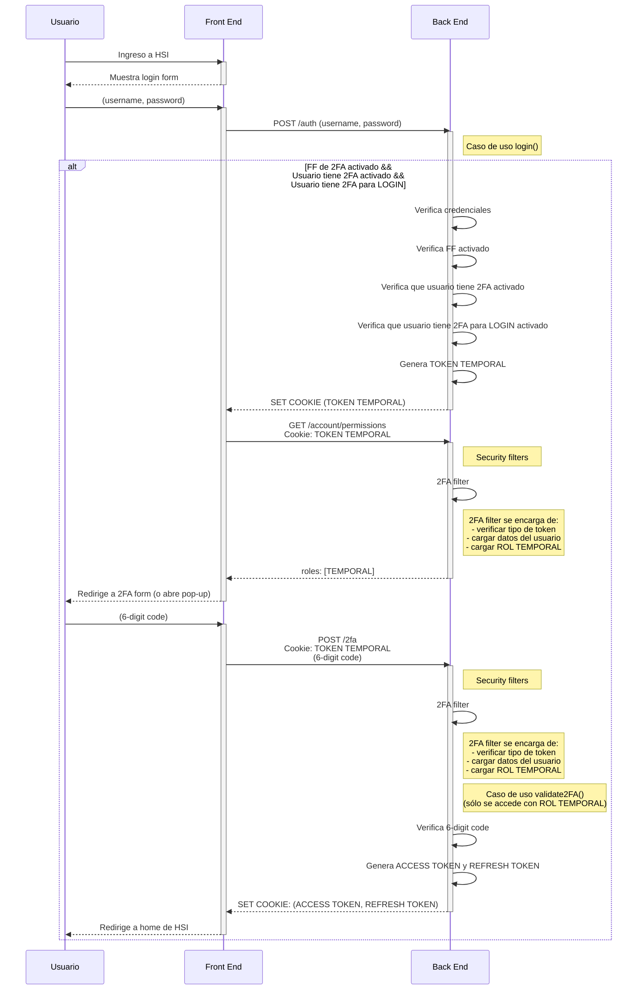

# Secuencia de Login con autenticación por doble factor

En los siguientes diagramas se esquematiza el orden de ejecución de las distintas etapas de LOGIN en un escenario con el doble factor de autenticación activado. A diferencia del login normal, este login se debe realizar en 2 pasos separados. En el primero se validan las credenciales del usuario, es decir, su username y contraseña. En el segundo se valida un código de 6 dígitos asociado al usuario. 

## Diagrama de flujo para escenario con guardado de tokens en Local Storage del browser

## Diagrama de flujo para escenario con manejo de tokens con Cookies

