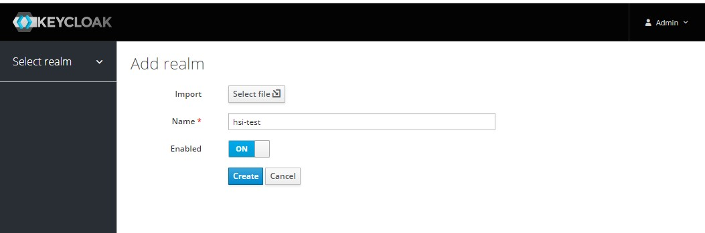
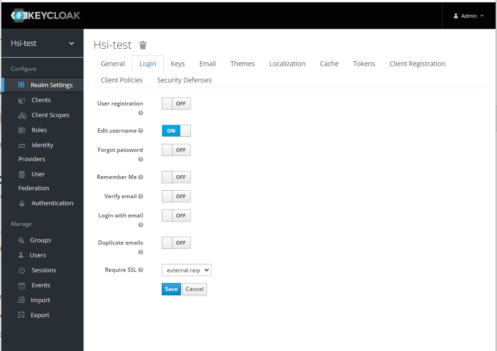
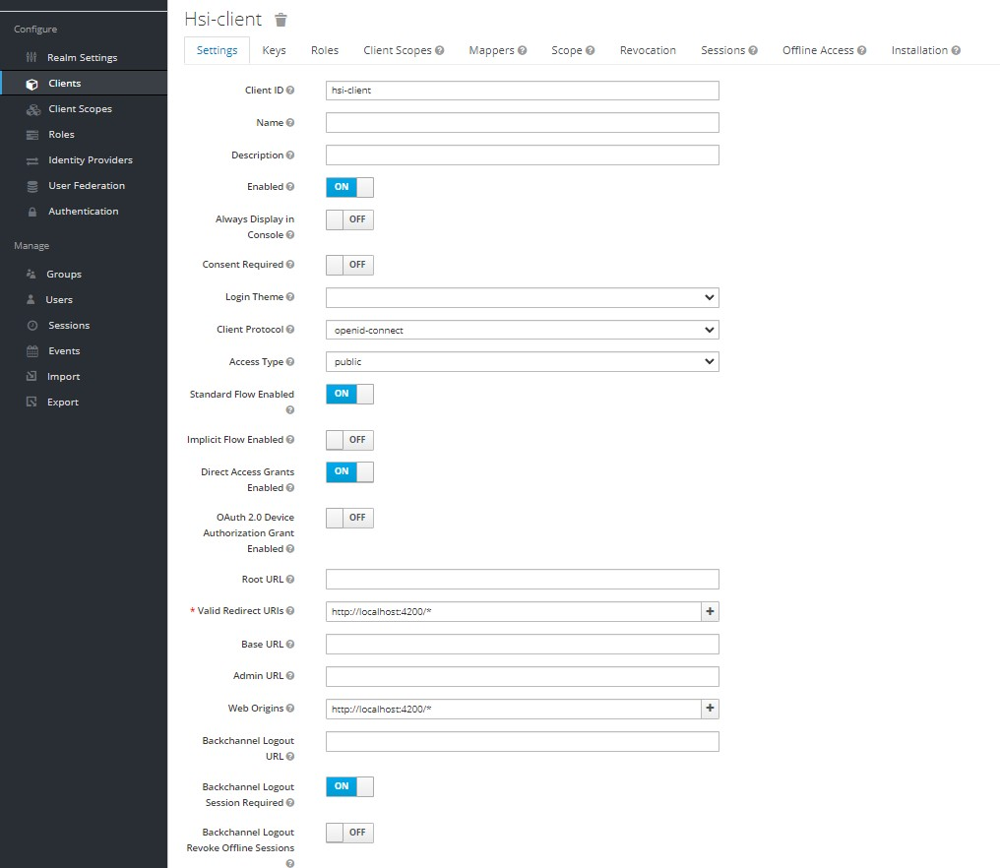

# Guía de configuración básica de Keycloak

En esta guía se explica cómo poner en funcionamiento un server de Keycloak básico para el uso como servidor de autenticación con OAuth para HSI.

1. Instalar Keycloak. Existen varias alternativas para la instalación de Keycloak, las cuales se encuentran en [este link](https://www.keycloak.org/getting-started). 
Una forma sencilla es usando Docker, que se puede hacer ejecutando el siguiente comando:
   
    `docker run -p 8080:8080 -e KEYCLOAK_USER=admin -e KEYCLOAK_PASSWORD=admin quay.io/keycloak/keycloak:16.1.0`

El comando configura el usuario administrador con username "_admin_" y password "_admin_". El servidor estará escuchando en `localhost:8080`

2. Ingresar a la consola de administración de Keycloak. En el browser ir a [http://localhost:8080/auth/admin](http://localhost:8080/auth/admin). Ingresar con las credenciales configuradas en el paso anterior.
3. En el menú de la izquierda clickear el botón **_Add realm_**. Asignarle un nombre al realm, por ejemplo, "_hsi-test_" como se muestra en la imagen. Clickear en **_Create_**.


    

4. En las configuraciones del realm, cambiar a la pestaña _**Login**_ y habilitar la opción _**Edit username**_. Configurar las demás opciones según se prefiera y clickear en **_Save_**.


   

5. En el menú de la izquierda, ir a _**Clients**_. En la parte superior de la tabla seleccionar **_Create_**. En el campo _Client ID_ ponerle un nombre al cliente, por ejemplo "_hsi-client_". Asegurarse de que el protocolo seleccionado sea "_openid-connect_". Clickear en _**Save**_.
6. En la configuración del cliente, asegurarse que _Access Type_ sea "_public_". Configurar _Valid Redirect URIs_ y _Web Origins_ según la URL base donde se encuentra el la WebApp y el Backoffice. Por ejemplo, si está corriendo la WebApp de forma local, configurar como en la imagen:


   

Dejar las demás opciones como están, y clickear en _**Save**_.

7. En el menú de la izquierda, ir a _**Users**_. Clickear en _**Add user**_. Asignarle un nombre al usuario que tendrá el rol de crear usuarios, por ejemplo "_user-admin_". Clickear en _**Save**_.

8. En las configuraciones de ese usuario, ir a la pestaña _**Credentials**_. Asignarle un password al usuario, por ejemplo "_admin123_", y deshabilitar la opción _Temporary_. Clickear _**Set Password**_.

9. Cambiar a la pestaña _**Role Mappings**_. En el select _Client Roles_, seleccionar "_realm-management_". En _Available Roles_ buscar "_manage-users_" y clickear _**Add selected**_.

10. Volver a _**Users**_. Clickear en _**Add user**_. Asignarle username "admin@example.com". Clickear en _**Save**_.

11. En las configuraciones de ese usuario, ir a la pestaña _**Credentials**_. Asignarle un password al usuario, por ejemplo "_admin123_", y deshabilitar la opción _Temporary_. Clickear _**Set Password**_.

12. Volver a _**Realm Settings**_ e ir a la pestaña _**Tokens**_. Revisar el valor configurado de _Access Token Lifespan_, ya que servirá para configurar el Back-End (por defecto son 5 minutos).

13. Antes de iniciar el Back End, configurar las siguientes propiedades de OAuth:

```   
    ws.oauth.enabled = true
    ws.oauth.realm = <NOMBRE DEL REALM>
    ws.oauth.client-id = <NOMBRE DEL CLIENTE>
    ws.oauth.token-expiration = <TIEMPO HASTA LA EXPIRACIÓN DEL ACCESS TOKEN EN SEGUNDOS>
    ws.oauth.user-admin.username = <NOMBRE DEL USUARIO ADMINISTRADOR DE USUARIOS>
    ws.oauth.user-admin.password = <CONTRASEÑA DEL USUARIO ADMINISTRADOR DE USUARIOS>
    ws.oauth.url.base = <URL BASE DONDE CORRE KEYCLOAK>
    ws.oauth.url.issuer = <URL BASE DONDE CORRE KEYCLOAK>/auth/realms/<NOMBRE DEL REALM>
```

Con los valores de ejemplo de esta guía, las propiedades quedan así: 

``` 
    ws.oauth.enabled = true
    ws.oauth.realm = hsi-test
    ws.oauth.client-id = hsi-client
    ws.oauth.token-expiration = 300
    ws.oauth.user-admin.username = user-admin
    ws.oauth.user-admin.password = admin123
    ws.oauth.url.base = http://localhost:8080
    ws.oauth.url.issuer = http://localhost:8080/auth/realms/hsi-test
```

14. Iniciar el Back End.
15. De ahora en adelante, los usuarios creados desde la aplicación serán creados también en Keycloak.