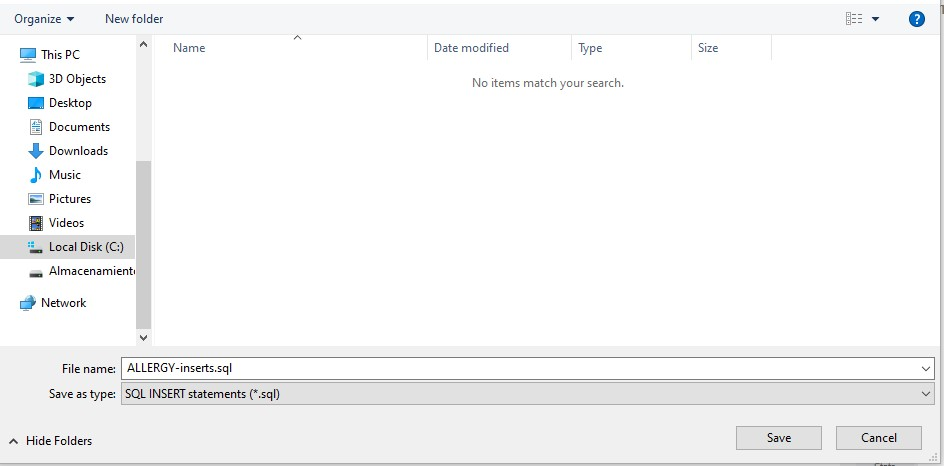

# Generar archivo CSV de conceptos Snomed

El objetivo de esta guía es describir los pasos a seguir para generar un archivo de conceptos Snomed a partir de la base de datos de Snomed CT para cargar conceptos en el sistema de HSI.

## Puesta en marcha de la base de datos MySQL

Para poder obtener conceptos según ECLs, se necesita una base de datos capaz de realizar dichas consultas. SNOMED International provee [esta guía](https://confluence.ihtsdotools.org/display/DOCSQLPG/SNOMED+CT+-+SQL+Practical+Guide) para configurar y usar una base de datos MySQL ya preparada con tablas, vistas, stored procedures útiles para ese tipo de consultas. Además, indica cómo configurar MySQL Workbench para conectarse a la base.

Las instrucciones que hay que seguir para la puesta en marcha están en el [Apéndice A](https://confluence.ihtsdotools.org/display/DOCSQLPG/Appendix+A%3A+Building+the+SNOMED+CT+Example+Database) de la guía.

Si bien en el [paso A.1](https://confluence.ihtsdotools.org/display/DOCSQLPG/A.1+Download+the+SNOMED+CT+Example+Database+Package) se provee un archivo comprimido con los scripts para cargar la creación de la base de datos y cargar la Release de Snomed, para que funcione con la Release argentina de mayo de 2021, los scripts se modificaron debido a que los nombres de los archivos a cargan no coincidían. Estos scripts modificados se pueden encontrar en [este otro archivo comprimido](./resources/SnomedRfsMySql-modified.rar). El resto de los pasos se siguen como indica la guía.

## Generar archivo CSV a partir de ECL

Como ya se mencionó anteriormente, la base de datos ya viene preparada con stored procedures útiles para consultar y filtrar por términos. Uno de ellos se explica en [esta parte](https://confluence.ihtsdotools.org/display/DOCSQLPG/4.9.4.+Search+Procedures) de la guía. Ese recibe un término de búsqueda y una expresión para el filtrado de conceptos.

Sin embargo, como lo que se desea es obtener todos los conceptos según una ECL sin buscar por un término particular, se puede utilizar el procedure `snomedct.eclQuery()`, que recibe una expresión ECL como parámetro. Por ejemplo, para obtener todos los conceptos de alergias hay que ejecutar `call snomedct.eclQuery('< 609328004 |disposición alérgica (hallazgo)|');`. En la siguiente imagen se puede observar el resultado de ejecutarlo en MySQL Workbench.


Los resultados de los términos son en inglés, por lo que hay que traducirlos. Para ello se va a crear una tabla temporal para albergar los resultados de la consulta y después obtener las traducciones de cada uno.

En primer lugar hay que exportar el resultado haciendo click sobre el botón _**Export**_ (marcado en rojo en la imagen anterior), y seleccionar la forma de guardado _SQL INSERT statements (*.sql)_, como se muestra en la imagen:



Con esto se generará un archivo con las sentencias para insertar cada fila del resultado en una tabla, que se puede llamar por ejemplo `temp_1`. Si abrimos este archivo vamos a ver algo como lo siguiente:

```
INSERT INTO `` (`conceptId`,`term`) VALUES (91931000,'Allergy to erythromycin (finding)');
INSERT INTO `` (`conceptId`,`term`) VALUES (91932007,'Allergy to fruit (finding)');
INSERT INTO `` (`conceptId`,`term`) VALUES (91934008,'Allergy to nut (finding)');
…
```

Como falta el nombre de la tabla donde se van a insertar, con un editor de texto podemos reemplazar todas las ocurrencias de **``** por **snomedct.temp_1**. Además debemos agregar al principio las sentencias de creación de la tabla. De esta manera, el archivo va a quedar de la siguiente manera:

```
DROP TABLE IF EXISTS snomedct.temp_1;
CREATE TABLE snomedct.temp_1 (conceptId bigint, term varchar(255));

INSERT INTO snomedct.temp_1 (`conceptId`,`term`) VALUES (91931000,'Allergy to erythromycin (finding)');
INSERT INTO snomedct.temp_1 (`conceptId`,`term`) VALUES (91932007,'Allergy to fruit (finding)');
INSERT INTO snomedct.temp_1 (`conceptId`,`term`) VALUES (91934008,'Allergy to nut (finding)');
…
```

Al cargar el archivo en MySQL Workbench y ejecutar todas las sentencias, se creará la tabla que sólo tiene todos los conceptos de alergias.

Ahora queda hacer la query para obtener las traducciones de los conceptos. Las traducciones se pueden encontrar en la tabla `snap_description`. La query a ejecutar queda como la siguiente:

```
SELECT t1.conceptId, REPLACE(sd.term,'\"','\'') AS term
FROM snomedct.temp_1 t1
LEFT JOIN snomedct.snap_description sd ON (t1.conceptId = sd.conceptId)
WHERE sd.languageCode = 'es'
    AND sd.typeId = 900000000000013009
    AND sd.active = true;
```

Las cláusulas del `WHERE` tienen el siguiente fin:
- `sd.languageCode = 'es'` para que sólo se obtengan los nombres de conceptos en español.
- `sd.typeId = 900000000000013009` porque ese es el tipo de las traducciones abreviadas.
- `sd.active = true` para filtrar las traducciones que ya no están activas.

Al ejecutar la consulta, se obtienen las traducciones de los términos y el sctid de los conceptos como se muestra en la imagen:


Esto se puede exportar haciendo click en el botón **_Export_** y seleccionando la forma de guardar _CSV (*.csv)_. Este archivo CSV se puede cargar en HSI a través del endpoint `/api/snowstorm/load-concepts-csv`, que acepta un archivo CSV y una clave ecl, que en el caso de alergias es **ALLERGY**.