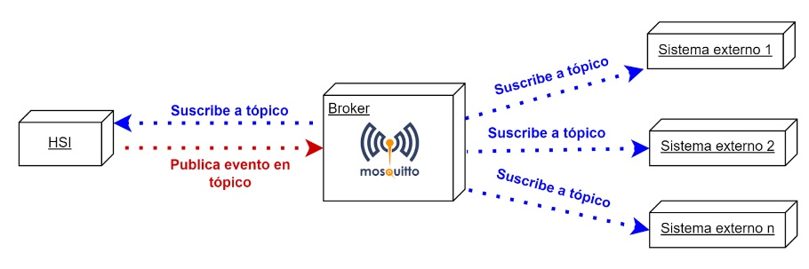

# Sistemas de eventos

Se agregó funcionalidad al sistema siguiendo una arquitectura orientada a eventos. Esta funcionalidad tiene como objetivo agregar un nuevo canal de comunicación entre nuestro sistema y otros sistemas externos que puedan tener las distintas jurisdicciones.

Cuando hablamos de una arquitectura orientada a eventos estamos estableciendo que el sistema de hospitales van a emitir eventos que informe sucesos importantes en el sistema. Estos eventos se transmitirán en forma de mensajes hacia un broker. Dicho broker es un canal central de comunicación bajo el cuál distintos sistemas se podrán conectar mediante un modelo de publicación/subscripción. La siguiente imagen mostraría la comunicación



## Implementación

Para implementar el sistema de eventos se usó como broker mosquitto. Mosquitto es un broker de mensajería de código abierto que usa el protocolo mqtt para el envío de mensajes. Algunas de sus características son:

- comunicación mediante mqtt con TLS
- comunicación mediante websockets con TLS
- manejos de roles y permisos (plugin de cedalo)

Teniendo en cuenta estas características el sistema de HSI, va a realizar publicaciones de eventos a unos tópicos específicos que se van a ir definiendo en el siguiente [documento del sistema](../../eventos.md), de la siguiente manera:


## Seguridad 

Conociendo los eventos que se publican, un sistema de una jurisdicción se puede conectar al broker para escuchar dichos eventos y hacer algo en consecuencia (estadísticas, cambios en el sistema, etc).

Para poder conectarse al broker, el equipo de HSI tiene que generarle credenciales de conexión (usuario y contraseña) al dicho sistema. Estas credenciales no solo lo identificará, sino también el equipo de HSI puede usar CEDALO para determinar qué eventos puede escuchar y qué eventos puede publicar.

CEDALO es una aplicación web que te permite gestionar mosquitto. Para eso el personal de HSI se puede logear en la aplicación


Una vez dentro la aplicación web se presenta de la siguiente forma:


De la página principal nos vamos a centrar en los menús: clients y  roles

### Menú Clients

En esta sección se puede  crear clientes que se van a conectar al sistema y establecer que roles tiene.


### Menú roles
En esta sección se puede crear roles y definir en qué tópico puede publicar y a cuál se puede suscribir.


Si accedemos a uno de los roles podemos ver lo siguiente en la pestaña ACLs


Esta pestaña te permite asociar al rol **R_ALTAMEDICACINTERNACION**,  el permiso de que un cliente puede suscribirse al tópico **HSI/HOSPITAL_API/ALTA_MEDICA**. Si un cliente tiene este rol podrá escuchar eventos que sucedan bajo ese tópico.

Por otra parte la siguiente imagen, muestra un el rol **PUBLICADORHSI**, que le puede dar a un cliente el permiso de publicar eventos al tópico HSI/#. Como se ve en este tópico se hizo uso de un carácter comodín (#) que indica que la publicación al tópico puede suceder sobre cualquier subtópico de **HSI/**. Por ejemplo, se podría publicar al tópico **HSI/HOSPITAL_ALTA_MEDICA**. 


Hasta ahora, se describió cómo los distintos actores se van a poder conectar y compartir información. Sin embargo, no se detalló qué formato tiene la información del evento/mensaje.  El formato del mensaje que se puede utilizar es JSON, dentro de este se puede adoptar cualquier tipo de contenido a establecer entre las partes. En la siguiente imagen se puede visualizar, utilizando un cliente de MQTTBox, los mensajes recibidos para el evento nueva consulta odontológica que el sistema de HSI genera.


#### Cuerpo del mensaje:

```json

{"description":"{\"patientId\":1,\"topic\":\"HSI/INSTITUTION/1/ODONTOLOGY/NUEVA_CONSULTA\"}"}
```

#### Topic:

HSI/INSTITUTION/1/ODONTOLOGY/NUEVA_CONSULTA


En resumen acá está diciendo que el paciente con id 1, tuvo una nueva consulta ambulatoria.
