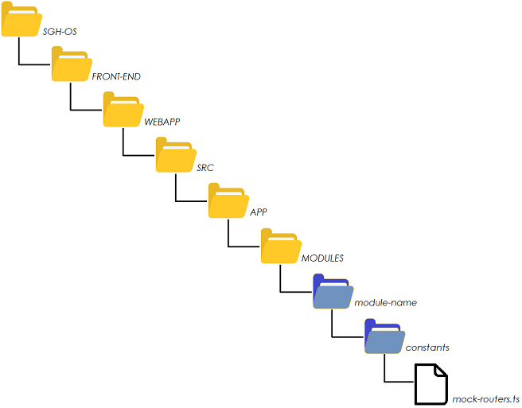

### Estructura Front-End

 1. Crear paquete del módulo
 
 

 2. Estructura de Código básica para comenzar — *copiar y pegar extracto reemplazando los nombres adecuadamente* —

```TypeScript
	export const MOCKS_MODULE = [ 
	
		{
			path: 'root',
			loads: [
				{
					name: ControllerName.methodName(pathVariableId: number, requestParamName1: type, requestParamName2: type): returnType
					roles: 'ADMINISTRATIVO', 'ENFERMERO', '...'
					method: 'GET'
					path: 'api/path/{pathVariableId}/path2?requestParamName1=value&requestParamName2=value...'
					body: {
					
					}
					fetch: [{
					}]
					comments: 'Comentario'
				},
				...
			],
			actions: [
				{
					name: 'navigate 1',
					navigate: './navigate-1/path'
				},
				{
					name: '[Modal] Nuevo navigate 2',
					navigate: './new-navigate-2',
				},
				...
			]
		}
	
	];
```	


## Convenciones:

***controllerName*** : nombre de la clase controller en Java, omitiendo el sufijo Controller. Por ejemplo, para el controlador principal del módulo Diary, la clase Java será DiaryController y en mockup sólo se escribirá Diary.   

***methodName***:  Para los casos generales puede utilizarse el nombre facilitado en los template; en casos particulares evitar el uso de palabras reservadas como *new*. 

***parámetros***: siempre se incluirán los parámetros del tipo `@PathVariable`, `@RequestParam` y `@RequestBody` diferenciando cada uno según el **PATH** definido. 

***roles***: utilizar las constantes declaradas en el enumerado `ERole` separadas por coma. Si el endpoint no requiere validación de permisos ***no*** completar el campo.  

***method***: especificar el verbo/metodo HTTP.  

***path***: declarar la url completa del endpoint a partir del contexto ***/api***. Tener en cuenta: 

 1. Las variables en el path se escriben entre llaves `{moduleId}`.  
 2. Los parámetros se indican al final a partir del caracter `?` y se concatenan con r `&`. 
 3. Separar los nombres con más de una palabra con el caracter  `-`.

> /api/institution/{institutionId}/module-name?stateId=1&typeId=2

***body***: estructuta JSON correspondiente al objeto `@RequestBody` para métodos **POST** y **PUT**. 

***fetch***: estructura JSON correspondiente al objeto de retorno del método. 

***comments***: útiles para aclaraciones importantes.

3. Escribir la estructura de endpoint necesarios. Los extractos descriptos a continuación representan un elemento interno al arreglo de `loads`. Considerar el reemplazo de la palabra ***Module*** por el nombre apropiado.  

### GET Element

```TypeScript
{
	name: 'Module.getOne(id: number): ModuleDto',
	roles: 'ADMINISTRATIVO', '...',
	method: 'GET',
	path: '/api/institution/{institutionId}/module-name/{id}',
	fetch: {
		id: 1,
		...
	}
},
```
Traducción a lenguaje Java
```java
@GetMapping("/{id}")  
@PreAuthorize("hasPermission(#institutionId, 'ADMINISTRATIVO')")  
public ResponseEntity<ModuleDto> getOne(@PathVariable(name = "institutionId") Integer institutionId, @PathVariable(name = "id") Integer id) {  
    LOG.debug("Input parameters -> institutionId {}", institutionId);  
    ModuleDto result = moduleService.getOne(id); 
    LOG.debug("Output -> {}", result);  
    return ResponseEntity.ok().body(result);  
}
```

### GET List element

```TypeScript
{
	name: 'Module.getAll(): ModuleListDto[]',
	roles: 'ADMINISTRATIVO', '...',
	method: 'GET',
	path: '/api/institution/{institutionId}/module-name',
	fetch: [{
		//Objeto del tipo ModuleListDto
		id: 1,
		...
	}]
}
```

Traducción a lenguaje Java
```java
@GetMapping  
@PreAuthorize("hasPermission(#institutionId, 'ADMINISTRATIVO')")  
public ResponseEntity<Collection<ModuleListDto>> getAll(@PathVariable(name = "institutionId") Integer institutionId) {  
    LOG.debug("Input parameters -> institutionId {}", institutionId);  
    Collection<ModuleListDto> result = moduleService.getAll(); 
    LOG.debug("Output -> {}", result);  
    return ResponseEntity.ok().body(result);  
}
```

### GET BY

```TypeScript
{
	name: 'Module.getBy(conditionId: number): ModuleDto[]',
	roles: 'ADMINISTRATIVO', '...',
	method: 'GET',
	path: '/api/institution/{institutionId}/module-name/path?conditionId=value',
	fetch: [{
		//Objeto del tipo ModuleDto
		id: 1,
		...
	}]
}
```

Traducción al lenguaje Java

```java
@GetMapping("/path")  
@PreAuthorize("hasPermission(#institutionId, 'ADMINISTRATIVO')")
public ResponseEntity<Collection<ModuleDto>> getBy(
		@PathVariable(name = "institutionId")  Integer institutionId, 
		@RequestParam(name = "conditionId") Integer conditionId){  
    LOG.debug("Input parameters -> institutionId {}, conditionId {}", institutionId, conditionId);  
    Collection<ModuleBo> moduleBos = moduleService.getBy(institutionId, conditionId);  
    Collection<ModuleDto> result = moduleMapper.parseTo(moduleBos);  
    LOG.debug(OUTPUT, result);  
    return ResponseEntity.ok(result);  
}
```


### POST
```TypeScript
{
	name: 'Module.create(body: moduleDto): number',
	roles: 'ADMINISTRATIVO', '...',
	method: 'POST',
	path: '/api/institution/{institutionId}/module-name',
	body: {
		//Objeto del tipo moduleDto
	}
	fetch: 15 //ID del objeto creado
}
```

Traducción al lenguaje Java

```java
@PostMapping  
@ResponseStatus(code = HttpStatus.CREATED)  
@Transactional
@PreAuthorize("hasPermission(#institutionId, 'ADMINISTRATIVO')")   
public @ResponseBody  
Integer create(@PathVariable(name = "institutionId") Integer institutionId, 
               @RequestBody ModuleDto body) {  
    LOG.debug("create module -> institutionId {}", institutionId);  
    ModuleBo moduleBo = moduleMapper.parseTo(body);  
    Integer result = moduleService.execute(institutionId, moduleBo);  
    LOG.debug("module created -> {}", result);  
    return result;  
}
```

### PUT

```TypeScript
{
	name: 'Module.update(moduleId: number, body: moduleDto): void',
	roles: 'ADMINISTRATIVO', '...',
	method: 'PUT',
	path: '/api/institution/{institutionId}/module-name/{moduleId}',
	body: {
		//Objeto del tipo moduleDto
	}
}
```
Traducción al lenguaje Java

```java
@PutMapping("/{moduleId}")  
@ResponseStatus(code = HttpStatus.OK)  
@PreAuthorize("hasPermission(#institutionId, 'ADMINISTRATIVO')")   
public void update(
			@PathVariable(name = "institutionId") Integer institutionId, 
			@PathVariable(name = "moduleId") Integer moduleId, 
			@RequestBody ModuleDto body) {  
    LOG.debug("update module -> institutionId {}", institutionId);  
    ModuleBo moduleBo = moduleMapper.parseTo(body);  
    moduleService.execute(moduleBo);  
    LOG.debug("module updated");  
}
```

### DELETE

```TypeScript
{
	name: 'Module.delete(moduleId: number): boolean',
	roles: 'ADMINISTRATIVO', '...',
	method: 'DELETE',
	path: '/api/institution/{institutionId}/module-name/{moduleId}'
}
```

Traducción al lenguaje Java

```java
@DeleteMapping("/{moduleId}")  
@PreAuthorize("hasPermission(#institutionId, 'ADMINISTRATIVO')")  
public ResponseEntity<Boolean> delete(@PathVariable(name = "institutionId") Integer institutionId,  
                                      @PathVariable(name = "moduleId") Integer moduleId) {  
    LOG.debug("Input parameters -> institutionId {}, diaryId {}", institutionId, diaryId);  
    moduleService.delete(moduleId);  
    LOG.debug(OUTPUT, Boolean.TRUE);  
    return ResponseEntity.ok(Boolean.TRUE);  
}
```
